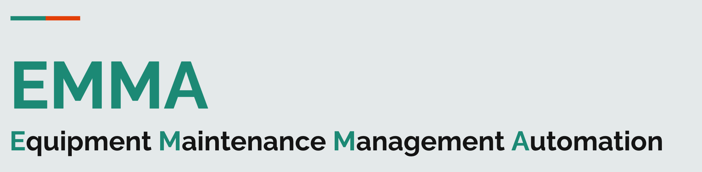

<br />
<div align="center">
    
  </a>

  <!-- <h3 align="center">Best-README-Template</h3> -->

  <p align="center">
    Project codebase for IS213 ESD - G4T7
    <br />

  </p>
</div>

## About The Project

In recent years, many companies have opted to pursue digital transformation in order to improve their efficiency. One key technology used is IoT – which can monitor equipment status, to allow for preventive maintenance. This has led to more dynamic scheduling of maintenance.

Equipment Maintenance Management Automation, or EMMA, seeks to streamline the process of managing and scheduling equipment maintanences by providing a platform to keep track of maintenance, equipment and inventory details. It can also integrate with IoT sensors to auto-schedule maintenance.

## Built With

#### Frontend
- Vue.js
- Vuetify

#### API Gateway
- Kong

Backend
- Python, Flask
- Node.js, Express with TypeScript
- Golang

Interprocess Communication
- REST
- AMQP (RabbitMQ)

External APIs
- Twilio
- SendGrid

## Getting Started

### Prerequisites
 - Docker - 20.10.22
 - Node - 19.6.1

### Configuring Backend
Ensure that there is a clean environment, with no other containers.

1. From root of project folder, open terminal and enter `docker compose up`.
2. Access http://localhost:1337 in the browser to create an admin user for Konga GUI.
```bash
Username: admin
Email:    <your email address>
Password: adminadmin
```

3. Sign in, and connect Konga to Kong by creating a new connection.
```bash
Name: default
Kong Admin URL: http://kong:8001
```
4. Click on Snapshots located on the sidebar
5. Select IMPORT FROM FILE and import ./utils/emma_snapshot.json
6. Click on DETAILS for the new snapshot created
7. Select RESTORE, tick all boxes, then click IMPORT OBJECTS

### Starting the application

1. From folder root, navigate to frontend and install dependencies

```bash
cd frontend
npm install
```
2. Launch application 
```bash
npm run dev
```
3. Access application in browser (default is port 5173)