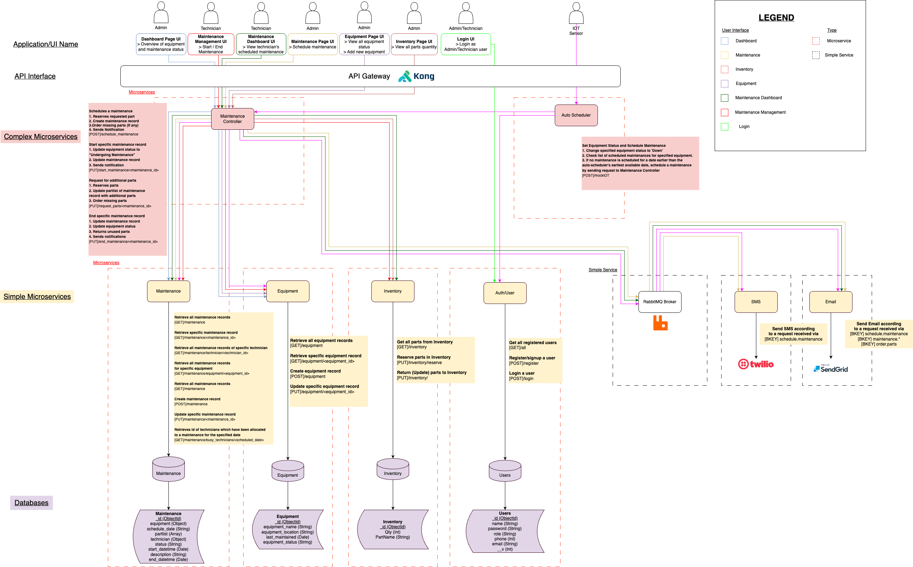
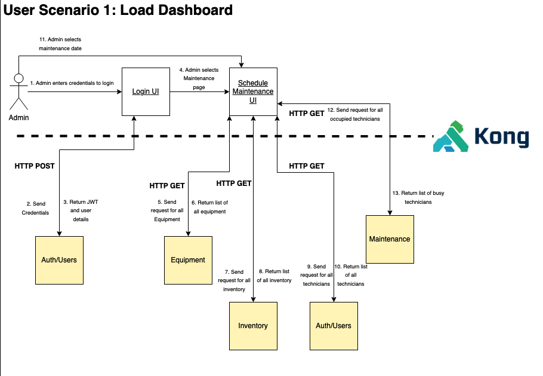
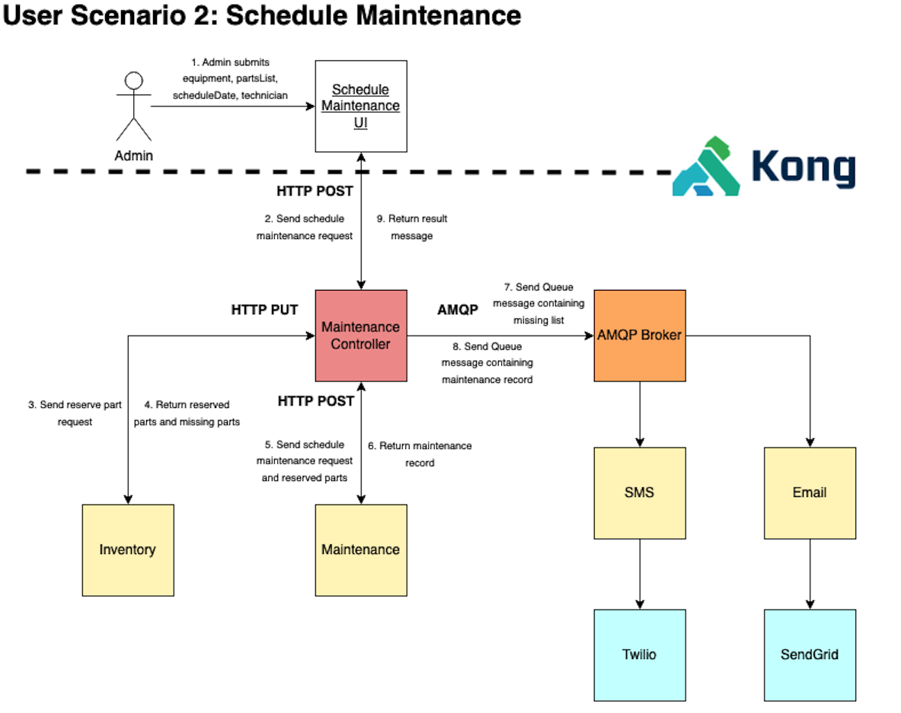
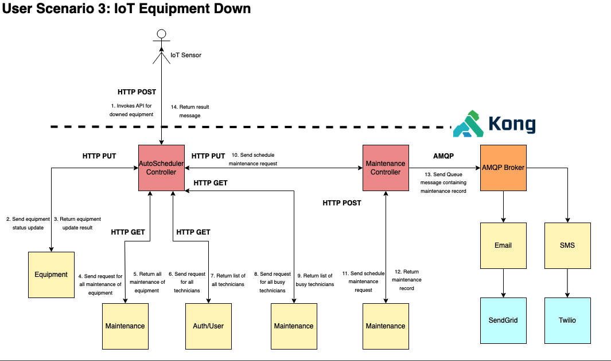
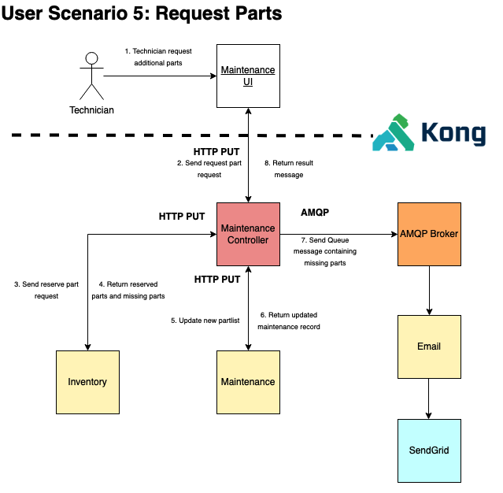
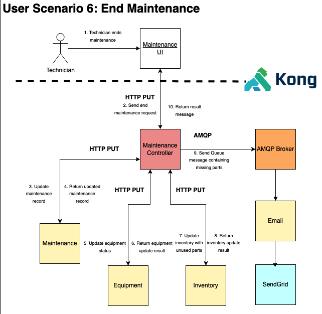

<br />
<div align="center">
    
  </a>

  <!-- <h3 align="center">Best-README-Template</h3> -->

  <p align="center">
    Project codebase for IS213 ESD - G4T7 (AY22/23)
    <br />

  </p>
</div>

## About The Project

In recent years, many companies have opted to pursue digital transformation in order to improve their efficiency. One key technology used is IoT – which can monitor equipment status, to allow for preventive maintenance. This has led to more dynamic scheduling of maintenance.

Equipment Maintenance Management Automation, or EMMA, seeks to streamline the process of managing and scheduling equipment maintanences by providing a platform to keep track of maintenance, equipment and inventory details. It can also integrate with IoT sensors to auto-schedule maintenance.

## Technical Diagram
 

## Built With

#### Frontend
- Vue.js
- Vuetify

#### API Gateway
- Kong

#### Backend
- Python, Flask
- TypeScript, Express
- Golang

#### Message Broker
- RabbitMQ

#### External APIs
- Twilio
- SendGrid

## Additional Details
1. SMS, Email and AutoScheduler microservices built using Go.
2. Auth microservice built using TypeScript with Express.
3. Used JSON Web Tokens for user authentication and authorization (12h expiry). 
4. Kong API gateway serves as single entry point for our microservices.
5. Kong JWT plugin checks for bearer token generated by the auth microservice.
6. Kong Rate Limiting plugion reduces chance of successful DDoS and brute force login attacks.
7. Used MongoDB Atlas for our database.

## Getting Started

### Prerequisites
 - Docker - 20.10.22
 - Node - 19.6.1

### Configuring Backend
Ensure that there is a clean environment, with no other containers.

1. From root of project folder, open terminal and enter `docker compose up`.
2. Access http://localhost:1337 in the browser to create an admin user for Konga GUI.
```bash
Username: admin
Email:    <your email address>
Password: adminadmin
```

3. Sign in, and connect Konga to Kong by creating a new connection.
```bash
Name: default
Kong Admin URL: http://kong:8001
```
4. Click on Snapshots located on the sidebar
5. Select IMPORT FROM FILE and import ./utils/emma_snapshot.json
6. Click on DETAILS for the new snapshot created
7. Select RESTORE, tick all boxes, then click IMPORT OBJECTS

### Starting the application

1. From folder root, navigate to frontend and install dependencies

```bash
cd frontend
npm install
```
2. Launch application 
```bash
npm run dev
```
3. Access application in browser (default is port 5173)


## User Scenarios








## Acknowledgements
- [Lim Seow Chong](https://github.com/limseowchong)
- [Chow Jun Yong Jeremy](https://github.com/jeremychow99)
- [Teng Wei Han Adam](https://github.com/adamtwh)
- [Deborah How Yi Hui](https://github.com/debhyh)
- [Tan Kai Jie Sean](https://github.com/seantkj)